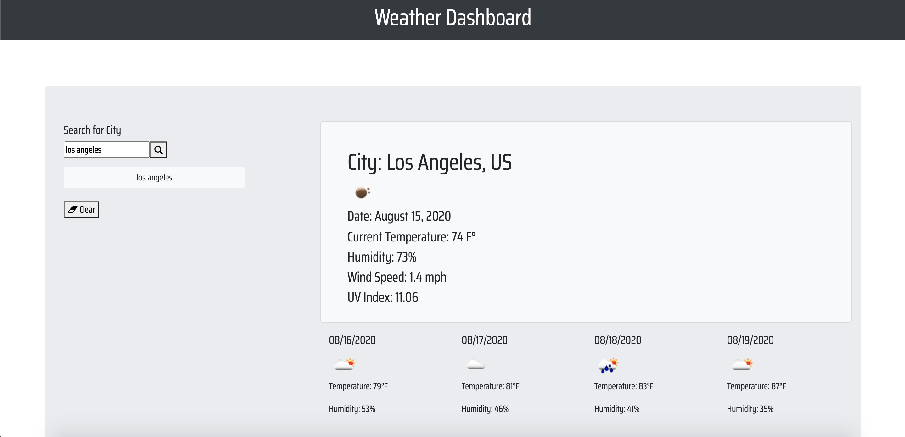

# Weather-Dashboard
When user searches with city name at the lefe side bar, the current weather information which includes Current Temperature, Humidity, Wind Speed, UV Index. There will be 4 days forecast as well. 

## Link
Please visit [Weather-Dashboard](https://juhee-k.github.io/weather-dashboard/) site!

## Screenshots

## Built with
- [HTML](https://developer.mozilla.org/en-US/docs/Web/HTML)
- [CSS](https://developer.mozilla.org/en-US/docs/Web/CSS)
- [Bootstrap](https://getbootstrap.com/)
- [Google Fonts](https://fonts.google.com/)
- [Open Weather API](https://openweathermap.org/)
- [jQuery](https://api.jquery.com/)

